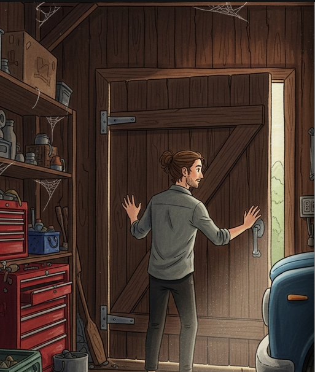

<!-- _class: title -->

# AI StoryBook

## Illustrate your imaginations to others

---

## The Problem

- Teen manga fans and writers wait 1 week to 1 month per illustrated chapter.

- Manual creation is slow, costly, and requires professional skills.

- DIY AI tools lack fixed style and long-range character/story consistency.

---

## Our Solution

- {'One-click ranobe-to-manga': 'generate 5–20 pages per chapter in minutes.'}

- Long-range character and plot consistency across chapters and runs.

- Fixed, reusable style packs and story-structure control.

- Built-in paneling, speech bubbles, and right-to-left layout.

---

<!-- _class: demo -->

### Demo 1: Shadow Slave (Manga Style)

**Input**

*Text:* "A frail-looking young man with pale skin and dark circles..."

*Reference Image:*

**Generated Output**

(PDF version with full pages available)

---

<!-- _class: demo -->

### Demo 2: The Boy and the Magic Van (Children's Book)

**Input**

*Text:* "Misi found an old, blue van in a dusty, cobweb‑filled garage..."

*Reference Image:*

**Generated Output**

---

## Market Opportunity

- **TAM:** $16–20B (Global B2C creators/fans + B2B small publishers)
- **SAM:** $1.5–2.5B  
- **SOM:** $40–60M (3-yr reachable)

---

## Business Model

- {'Pay-per-chapter': '$2.99 (5 pages), $9.99 (20 pages).'}

- Marketplace for style packs and publisher revenue sharing/licensing.

---

## Roadmap

### 🎯 Short Term
Public beta, 10+ styles, 20-page chapters, EN↔JP translation.

### 🚀 Long Term
Style marketplace, exports, publisher API pilots, early video/animatics.

---

## Meet the Team

**Abdulazizbek Gainazarov** - *Data Scientist*
Work at WizzAir, Bachelor’s Degree in CS.

**Bálint Décsi** - *Data Engineer*
Work at Deutsche Telekom IT Solutions HU, Master's degree in Data Science for ML.

---

## The Ask

$15k in API or GPU credits, publisher intros, legal regulations advice.

---

<!-- _class: title -->

# Thank You!

## Let's build the future of storytelling together.

