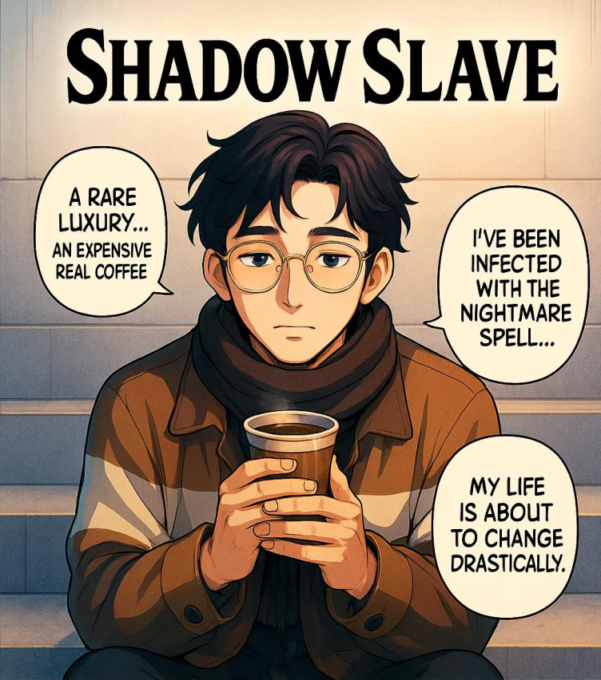
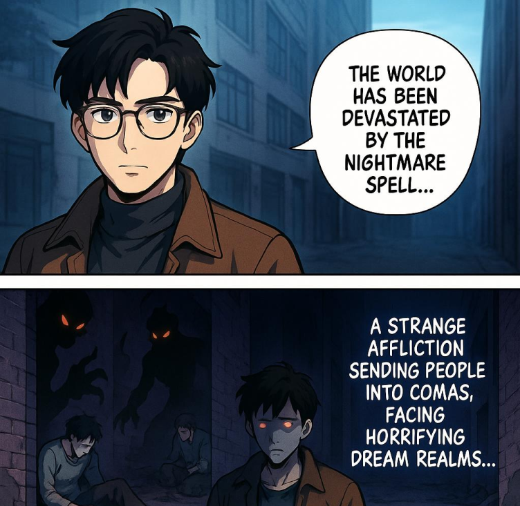
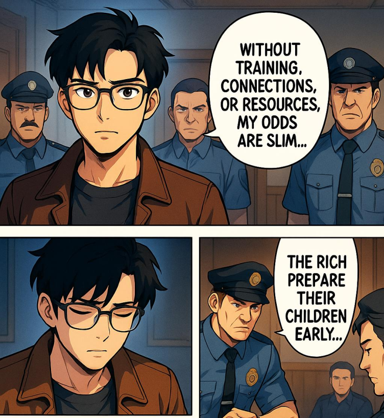
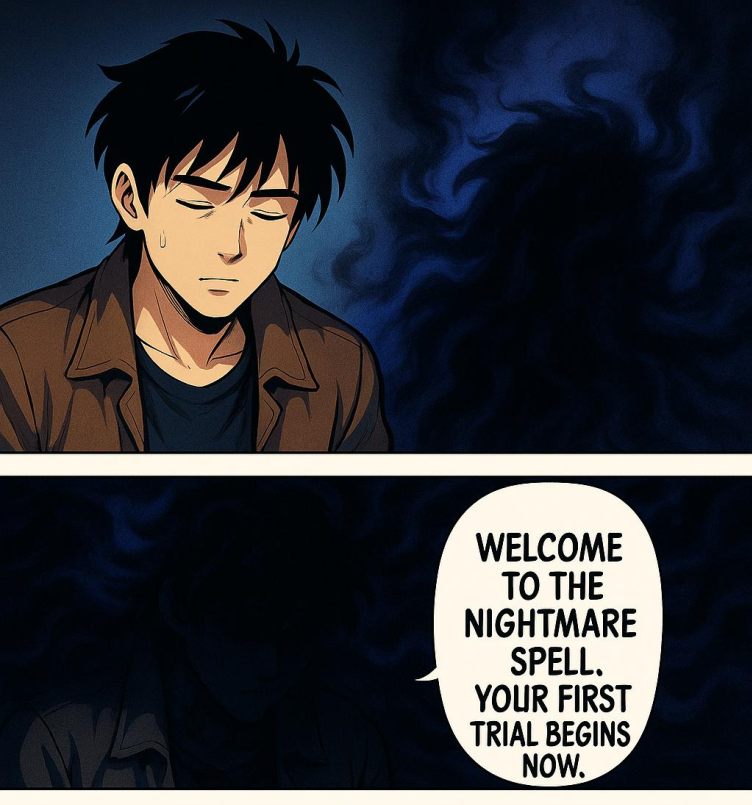
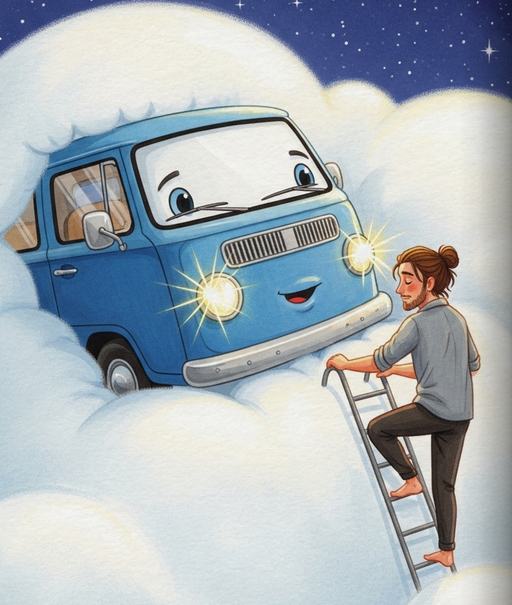

<!-- _class: title -->

# Comics Factory

## Illustrate your imaginations to others

Tired of waiting for new chapters? Continue on your own! One-click turns light novels into consistent, styled manga.

MVP live: 5-page chapters from 1k–1.5k words in ~5 minutes.

---

## The Problem

- Teen manga fans and writers wait 1 week to 1 month per illustrated chapter.

- Manual creation is slow, costly, and requires professional skills.

- DIY AI tools lack fixed style and long-range character/story consistency.

---

## Our Solution

- {'One-click ranobe-to-manga': 'generate 5–20 pages per chapter in minutes.'}

- Built-in paneling, speech bubbles, right-to-left layout, EN translation.

- {'Sample pages': 'scan QR code for demo'}

Scan for demo samples

---

## Product Features

- Style packs with consistent look; multi-chapter character continuity.

- Upload your images with text to align style or inject characters—make the hero look like you.

- Panel layout engine, speech bubbles, chapter structuring, export formats.

---

## Innovation: Why We Win

- Long-range character and plot consistency across chapters and runs.

- Fixed, reusable style packs and story-structure control.

- Cost/time: ~5 minutes vs weeks; ~$4/20 pages now → ~$0.04/20 pages with local GPUs.

---

<!-- _class: demo -->

### Demo 1: Shadow Slave (Manga Style)

**Input**

*Plot:* "Sunny looked around with curiosity, noting reinforced armor plates on the walls..."

*Reference Image:*

**Generated Output**

(PDF version with full pages available)

---

<!-- _class: demo -->

### Demo 2: The Boy and the Magic Van (Children's Book)

**Input**

*Plot:* "Misi found an old, blue van in a dusty, cobweb‑filled garage..."

*Reference Image:*

**Generated Output**

---

## Market Opportunity

- **TAM:** $16–20B (Global B2C creators/fans + B2B small publishers)
- **SAM:** $1.5–2.5B  
- **SOM:** $40–60M (3-yr reachable)

**Initial focus:** Light-novel-to-manga and teen creator communities

---

## Business Model & Pricing

- Pay-per-chapter: $2.99 (5 pages), $9.99 (20 pages); 1 free 5-page on signup

- Future: marketplace for style packs; publisher revenue share/licensing

- IP policy: licensed/user data; inspired-by styles; no artist mimicry.

---

## Technology & Scalability

- Fine-tuned Autoregressive Transformers/LoRA style packs, character embeddings, retrieval for continuity; layout & speech engine.

- Today via OpenAI/Google APIs; switchable to local GPUs when available.

- Costs: ~$1 per 5 pages now (~$4/20p) → ~$0.04/20p; partner API in ~6 months.

---

## Go-To-Market Strategy

- Self-serve web beta; community growth via Discord/Reddit/anime subs, WebNovel

- Outreach to Webtoon/Tapas creators; university anime/manga clubs

- YouTube/TikTok creator partnerships; publisher pilots in progress.

---

## Competition & Differentiation

| Solution | Time | Consistency | Styles | Bulk |
|----------|------|-------------|--------|------|

| **GenAI + manual (comicsmaker.ai, leonardo.ai, Midjourney, NovelAI)** | 30 min | Yes | Yes | No |

| **Storybook engines (Gemini, storywizard.ai)** | 1 min | No | No | Yes |

| **Full GenAI (loremachine.ai, OpenAI Image)** | 15 min | Yes | Yes | No |

| **AI StoryBook** | 5 min | Yes | Yes | Yes |

**Key Differentiators:**

- Long-term character/story consistency

- Fixed style packs

- 5–10 chapters/run

- Speed and cost

---

## Roadmap

### 🎯 Short Term (0–6 mo)
0–6 mo: Public beta, 10+ styles, 20-page chapters, 10k-word runs, EN↔JP

### 🚀 Long Term (6–24 mo)
6–24 mo: style marketplace, exports, publisher API pilots; visual-novel builder, early video/animatics

**Projected Outcomes:**
- Year 1: ~1,500 paying creators, ~5 publisher pilots, ARR ~$300k
- Year 2: ~6,000/15, ~$1.6M
- Year 3: ~20,000/40, ~$6M

---

## Traction

- MVP: Supports 1 manga style + basic children's storybooks

- 20 chapters generated

- Waitlist 20; pilots in progress

- Demo: sample PDF linked

- Public web beta 1 month

- More styles and 10k-word runs this year

---

## Meet the Team

**Abdulazizbek Gainazarov** - *Data Scientist*
Work at WizzAir, Bachelor’s Degree in CS.

**Bálint Décsi** - *Data Engineer*
Work at Deutsche Telekom IT Solutions HU, Master's degree in Data Science for ML

---

## The Ask

$15k in API or GPU credits, publisher intros, legal regulations advice

---

<!-- _class: title -->

# Thank You!

## Let's build the future of storytelling together.

